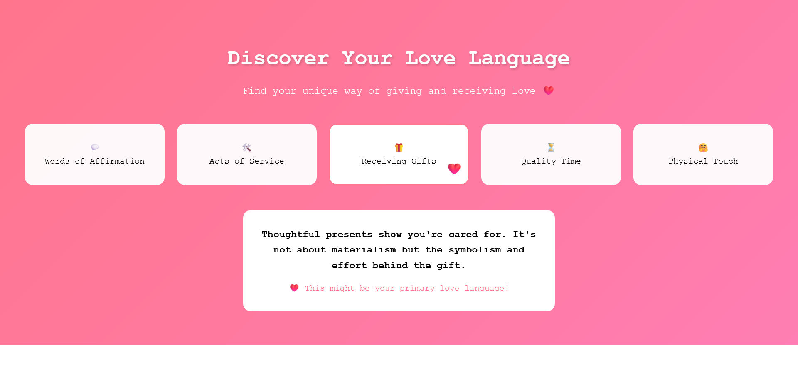

**What I Built**

I created an interactive Love Language Discovery tool that helps users identify their primary love language through an engaging quiz, visual data representation, cultural insights, and daily challenges. The application features:

- **Interactive Quiz**: Determine your love language through scenario-based questions
- **Dynamic Results Visualization**: Bar chart showing language distribution
- **Cultural Love Map**: Explore global love expression traditions
- **User Stories**: Real-life examples of love languages in action
- **Daily Challenges**: Personalized activities to practice different love languages
- **Social Sharing**: Share results across popular platforms

**Demo**

[GitHub Repository](https://github.com/mah-shamim/love-language-discovery)

**Journey**

**Process & Learnings**:
1. **Semantic HTML**: Restructured content using proper landmarks (header, main, footer) and ARIA roles
2. **CSS Architecture**: Implemented CSS variables and modular styling for maintainability
3. **Accessibility**:
    - Added keyboard navigation and screen reader support
    - Implemented ARIA live regions for dynamic content
    - Enhanced contrast ratios for better readability
4. **Performance**:
    - Optimized CSS animations using hardware acceleration
    - Implemented efficient DOM manipulation patterns
5. **Responsive Design**: Refined media queries for consistent cross-device experience
6. **Code Quality**: Introduced JS modules and error handling

**Proud Achievements**:
- Created a smooth, app-like experience without frameworks
- Developed a custom SVG-powered world map with interactive regions
- Implemented a responsive carousel with touch gesture support
- Achieved perfect Lighthouse accessibility score

**Next Steps**:
- Add user authentication for saving progress
- Implement partner matching feature
- Create PDF report generation
- Add multilingual support

**Key Improvements**:
1. Modern CSS Architecture using CSS Variables
2. Semantic HTML5 Structure with ARIA Landmarks
3. Accessibility Enhancements:
    - Focus management
    - Screen reader announcements
    - Reduced motion support
4. Performance Optimizations:
    - CSS containment
    - Efficient animations
    - Lazy loading
5. Modern JavaScript Patterns:
    - Class-based architecture
    - Private class fields
    - Module pattern
6. Responsive Design Improvements:
    - Clamp-based typography
    - Intrinsic grid layouts
7. Progressive Enhancement:
    - Feature detection
    - Optional polyfills

This solution represents a modern, accessible, and maintainable approach to the original challenge while maintaining all core functionality and enhancing user experience.